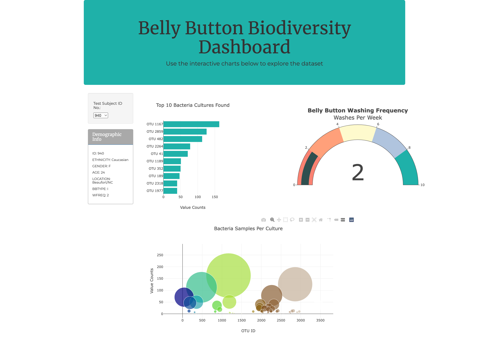

# Bellybutton_Biodiversity

## Purpose
The purpose of this project was to create a dashboard using Plotly and JavaScript D3 to display the data in the bacterial culture results data file. This data includes the type and amount of bacteria species found in the belly button of the study participants.

### Resources
[Belly Button Samples](samples.json)

### Dashboard
The dashboard includes a bar chart of the top ten bacteria found in the subject's belly button, a bubble chart of all of the bacteria found in the subject's belly button, and a gauge displaying the frequency at whoih the test subject washes his or her belly button. There is a drop down menu to select the ID of the participant whose results are then shown in the graphs.

#### View the dashboard: [Belly Button BioDiversity](https://jennadodge.github.io/Bellybutton_Biodiversity/)

#### Screenshot of Completed Website

### Customizations
The following changes were made to [index.html](index.html), [charts.js](static/js/charts.js) and [style.css](static/css/style.css) to customize the website:
- Added custom font for headings h1-h4 (Merriweather)
- Added custom font for paragraph, h5, and h6 fonts (Montserrat)
- Custom background-color for Jumbotron
- Custom background-color and border-color for panel displaying demoraphic information
- Added column of width 2 to the left of the bubble chart so the bubble chart is lined up with the bar chart.
- Included custom colors on Belly Button Washing Frequency gauge
- Included custom colors for bar chart